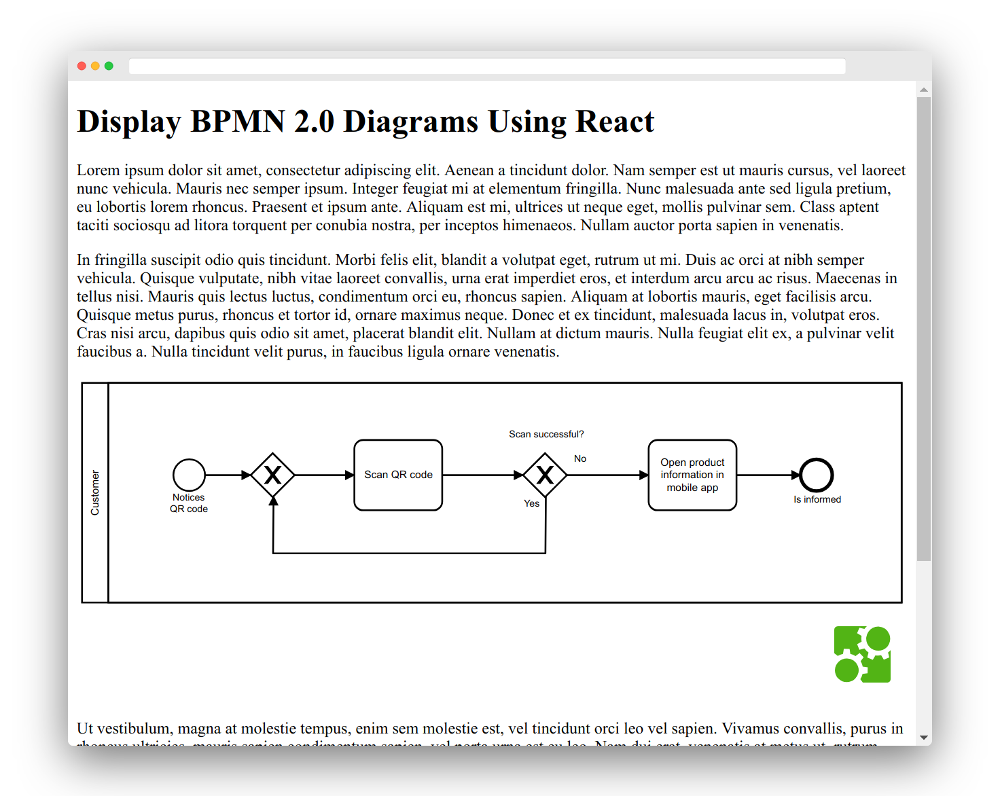

# react-bpmn Example

An example how to use [react-bpmn](../) to display a BPMN 2.0 diagram in a React app.




## Run the Example

To run the example:

```
npm install
npm start
```

This puts up the example to [localhost:9869/public/index.html](http://localhost:9869/public/index.html).


## License

MIT